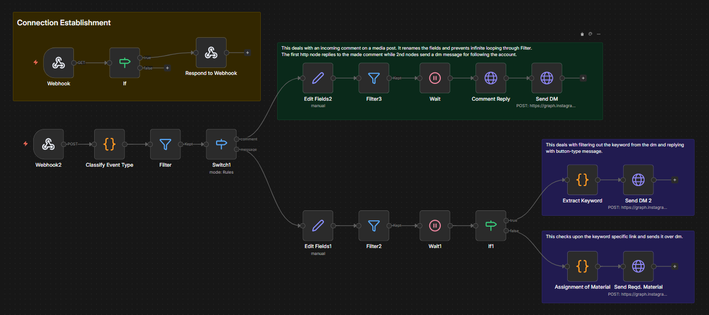

# Instagram Comment Keyword DM Automation (n8n)

A real-time Instagram automation workflow built in n8n that automatically detects specific keywords in post comments and sends personalized Direct Messages (DMs) with gated content delivery and smart filtering logic.

---

## 📌 Overview

This project connects Instagram (Meta Graph API) with n8n to automate comment-triggered DM campaigns.

When a user comments a specific keyword on a post (e.g., "ebook", "guide", "template"), the workflow:

- Detects the comment instantly via Meta Webhook  
- Filters and classifies the event type  
- Matches the keyword  
- Sends an automated reply to the comment  
- Sends a personalized DM to the user  
- Handles follow-up keyword replies inside DM  
- Prevents infinite loops and duplicate triggers  

This system replicates the popular Instagram growth strategy:

> “Comment *GUIDE* and we’ll send it to your DM.”

---

## 🏗️ Workflow Architecture

### 1️⃣ Connection Establishment (Webhook Verification)

- Webhook (GET)  
- If Node (Verify Token Check)  
- Respond to Webhook  

Handles Meta’s webhook verification challenge during setup.

---

### 2️⃣ Comment Processing Flow

- Webhook (POST – Event Listener)  
- Classify Event Type (Code Node)  
- Filter (Ignore non-comment events)  
- Switch (Comment vs DM message branch)  

Ensures only relevant Instagram events are processed.

---

### 3️⃣ Comment Automation Branch

- Edit Fields (Normalize comment payload)  
- Filter (Prevent bot-loop & duplicates)  
- Wait (Short delay for safe API timing)  
- Comment Reply (Public reply to comment)  
- Send DM (Private message to commenter via Graph API)  

This branch:

- Responds publicly to increase engagement  
- Sends the initial DM with instructions or CTA  

---

### 4️⃣ DM Keyword Processing Branch

- Edit Fields (Normalize DM message)  
- Filter (Prevent re-triggering)  
- Wait (Anti-spam delay)  
- IF Node (Check for keyword)  

If TRUE:

- Extract Keyword (Code Node)  
- Send DM 2 (Button-style or structured message)  

Else:

- Assignment of Material (Map keyword → resource)  
- Send Requested Material (Graph API call)  

This allows multi-step DM conversations and gated content delivery.

---

## 🔄 Workflow Visual



---

## 🧠 How It Works

### 1. User Comments on Post

Example:

- “ebook”  
- “guide”  
- “send template”  

The webhook captures the comment event in real-time.

---

### 2. Event Classification

The workflow:

- Detects whether the event is a comment or DM  
- Prevents infinite loops (bot replying to itself)  
- Filters invalid or duplicate payloads  

---

### 3. Keyword Detection

The Switch + Code nodes:

- Match predefined keywords  
- Normalize case sensitivity  
- Extract relevant trigger words  

Example mapping:

```
ebook → Ebook Resource  
guide → Free Guide PDF  
template → Downloadable Template  
```

---

### 4. Automated Engagement

The system:

- Replies publicly to increase engagement:

  > “Check your DMs 👋”

- Sends a private DM with:
  - Call-to-action  
  - Follow instruction (optional gating)  
  - Download link or next-step keyword prompt  

---

### 5. Gated Delivery (Optional Logic)

You can configure:

- Step 1 → Ask user to follow account  
- Step 2 → Wait node  
- Step 3 → Deliver material  

Since Instagram API does not expose follower-checking directly, gating is implemented via conversational logic.

---

## 🛠️ Tech Stack

- n8n (Workflow Automation)  
- Meta Graph API (Instagram Messaging API)  
- Instagram Business Account  
- Facebook Developer App  
- Webhook (Real-Time Event Subscription)  
- HTTP Request Nodes  

---

## 🔐 Required Credentials

To run this workflow, configure the following in n8n:

- Meta App ID  
- Meta App Secret  
- Page Access Token  
- Instagram Business Account ID  
- Webhook Verify Token  

Required permissions (App Review may be required):

- pages_manage_metadata  
- pages_read_engagement  
- instagram_basic  
- instagram_manage_comments  
- instagram_manage_messages  

---

## ✅ Features

- Real-time Instagram comment detection  
- Keyword-based automation  
- Public comment reply + private DM  
- Multi-keyword campaign support  
- DM follow-up handling  
- Button-style DM messages  
- Infinite loop prevention  
- Anti-spam delay handling  
- Modular workflow branches  
- Fully customizable keyword-to-resource mapping  

---

## 🎯 Use Cases

- Lead magnet delivery via Instagram  
- Ebook / PDF auto distribution  
- Course waitlist automation  
- Marketing funnel entry automation  
- Influencer engagement campaigns  
- Growth hacking experiments  
- Portfolio-grade automation project  

---  
